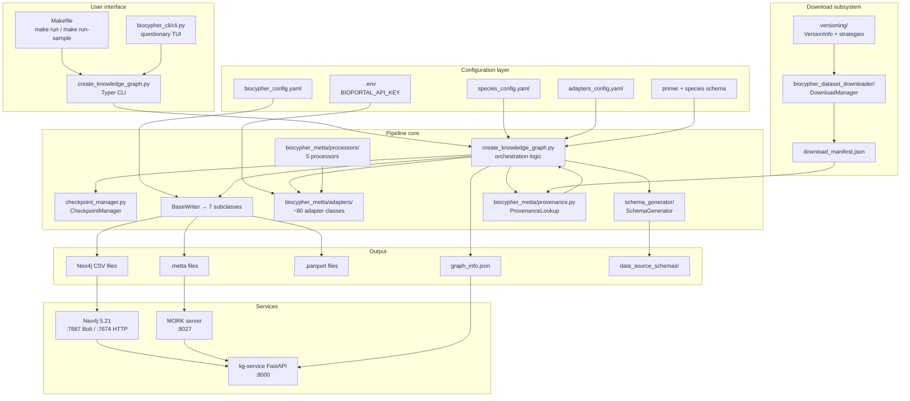

# Architecture

This document describes the system architecture: how components depend on each other and how data flows between them. For execution sequence diagrams, see [data-flow.md](data-flow.md). For component class hierarchies, see [component-diagrams.md](component-diagrams.md).

---

## Architectural principles

1. **Adapter pattern** — Every data source is encapsulated in an `Adapter` class with a uniform interface. Adding a new source requires only a new adapter + YAML config entry.

2. **Writer abstraction** — Output format is a runtime choice. The same adapter pipeline can emit Neo4j CSV, MeTTa, Parquet, or any other format by swapping the writer.

3. **Schema-driven validation** — Node and edge labels are validated against a Biolink-compatible schema. Incorrect labels are caught before any data is written.

4. **Resumable execution** — A checkpoint file persists pipeline state after each adapter. Interrupted runs resume from the last successful adapter.

5. **Declarative configuration** — All data source paths, adapter classes, and schema types are declared in YAML files. The orchestrator (`create_knowledge_graph.py`) has no hardcoded data source knowledge.

---

## Component dependency graph

---

## Separation of concerns

| Layer | Responsibility | Files |
|---|---|---|
| **User interface** | Entry points for humans | `Makefile`, `biocypher_cli/cli.py`, `create_knowledge_graph.py` (CLI) |
| **Orchestration** | Adapter loop, checkpointing, post-processing | `create_knowledge_graph.py` (logic), `checkpoint_manager.py` |
| **Data acquisition** | Download, version tracking, manifest | `biocypher_dataset_downloader/` |
| **Adaptation** | Raw data → typed nodes/edges | `biocypher_metta/adapters/` |
| **ID mapping** | Cross-database identifier normalization | `biocypher_metta/processors/` |
| **Serialization** | Format-specific output writing | `biocypher_metta/` (writer modules: `*_writer.py`) |
| **Schema** | Type definitions, Biolink mapping | `config/*_schema_config.yaml` |
| **Service** | REST API, versioning, live queries | `kg-service/` |
| **Storage** | Graph database, MeTTa query engine | Neo4j, MORK |

---

## Key design decisions

**Why 87 separate adapter files?** Each data source has unique parsing logic, ID conventions, and update patterns. A single generic adapter was rejected in favor of source-specific classes for maintainability and testability.

**Why YAML for adapter configuration?** The adapter config YAML (`*_adapters_config.yaml`) is the single source of truth for what data is in the KG. It's human-readable, diffable in git, and selectively runnable via `--include-adapters`. Configuration lives outside code.

**Why checkpointing after each adapter?** A full KG run takes 8–24 hours. Losing progress to a crash or OOM kill is unacceptable. The checkpoint file allows resuming from the last successful adapter without re-running anything.

**Why offline Biolink mode?** The Biolink OWL model is bundled locally (`config/biolink-model.owl.ttl`). Remote validation calls would add latency and require internet access in air-gapped environments.

---

## Known architectural gaps

1. **No parallelism** — Adapters run sequentially. The pipeline is single-threaded by design (to keep the checkpoint and accumulator state simple), but horizontal scaling via sharded adapter configs is possible.

2. **kg-service missing modules** — `meta.py` and `entities.py` are imported in `main.py` but don't exist, preventing startup.

3. **Server-specific paths** — `ARCHIVE_BASE`, `VERSION_DIFF_SCRIPT`, and `MORK_SUMMARY_SCRIPT` in `kg-service/backend/core/config.py` default to absolute paths on a specific server.

4. **MORK port discrepancy** — Container exposes `8027`; kg-service defaults to `8432`.

5. **Incomplete species** — `rno` is declared in `species_config.yaml` but `config/rno/rno_adapters_config.yaml` and `config/rno/rno_schema_config.yaml` are missing. `mmu` and `cel` have ontology-only adapter configs.
