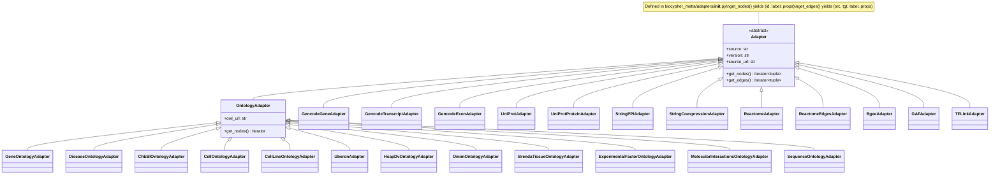
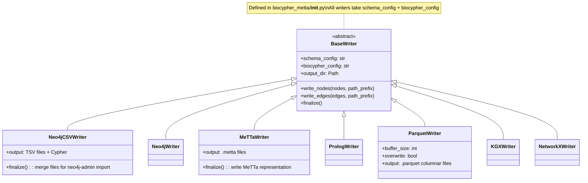
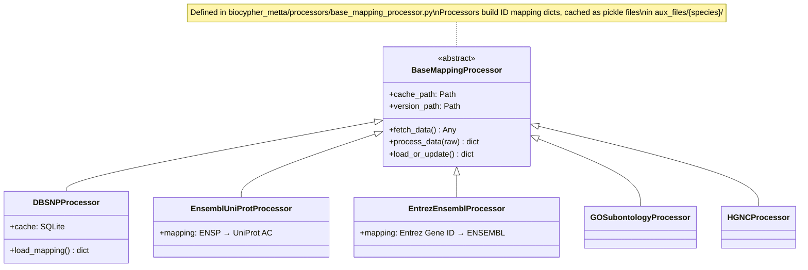
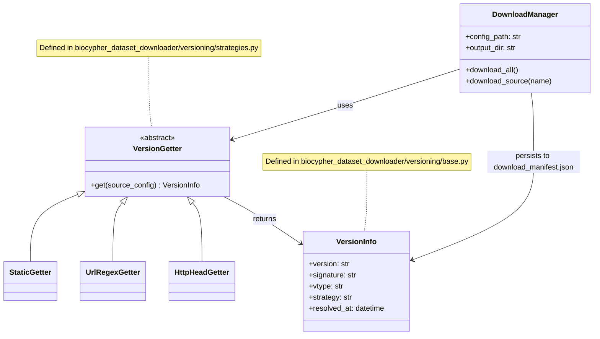

# Component Diagrams

This document contains Mermaid class and hierarchy diagrams for the major component groups. For execution sequence and state diagrams, see [data-flow.md](data-flow.md).

---

## Adapter hierarchy



---

## Writer hierarchy



---

## Processor hierarchy



---

## Download and versioning component map



---

## KG service architecture

```mermaid
graph TD
    subgraph FastAPI["kg-service FastAPI (port 8000)"]
        MAIN[main.py\nCORS + scheduler\n72h refresh]
        SR[/api/summary]
        UR[/api/updates]
        GIR[/api/graph-info\n/api/graph-info/status]
        VR[/api/databases/*\n/api/versions/*]
        DR[/api/databases\n/api/databases/{db_type}/status]
        ROOT["GET /\nGET /health"]
    end

    subgraph Core["core/"]
        CFG[config.py\nSettings Pydantic model]
        NC[neo4j_client.py\nNeo4j driver wrapper]
        GIC[graph_info_cache.py\n72h cached reader]
    end

    subgraph DB["External services"]
        NEO4J[Neo4j\nbolt://localhost:7887]
        MORK_SVC[MORK\nhttp://localhost:8027]
        FS[Local filesystem\nARCHIVE_BASE + graph_info.json]
    end

    MAIN --> SR
    MAIN --> UR
    MAIN --> GIR
    MAIN --> VR
    MAIN --> DR
    MAIN --> ROOT

    SR --> NC
    UR --> NC
    GIR --> GIC
    VR --> CFG
    VR --> FS

    NC --> NEO4J
    GIC --> FS
    VR --> MORK_SVC

    CFG --> NEO4J
    CFG --> MORK_SVC
```

> **Known issue:** `main.py` line 8 imports `meta` and `entities` from `backend.api.routes` but neither file exists. The FastAPI app cannot start until this is resolved. See [endpoints.md](../api/endpoints.md).

---

## Configuration inheritance

```mermaid
graph TD
    BIOLINK[config/biolink-model.owl.ttl\nBiolink ontology] --> BC
    BC[config/biocypher_config.yaml\nframework settings] --> WRITER[Writers]
    BC --> BIOCYPHER_CLS[BioCypher class]

    PRIMER[config/primer_schema_config.yaml\n36 nodes · 108 edges] --> MERGE
    HSA_SCHEMA[config/hsa/hsa_schema_config.yaml\nhuman extensions] --> MERGE
    DMEL_SCHEMA[config/dmel/dmel_schema_config.yaml\nDrosophila extensions] --> MERGE

    MERGE[merge_schemas()\nin create_knowledge_graph.py] --> WRITER
    MERGE --> BIOCYPHER_CLS

    SC[config/species_config.yaml] --> MAIN[create_knowledge_graph.py main()]
    HSA_AC[config/hsa/hsa_adapters_config.yaml] --> MAIN
    DMEL_AC[config/dmel/dmel_adapters_config.yaml] --> MAIN
    ENV[.env file\nBIOPORTAL_API_KEY] --> MAIN
