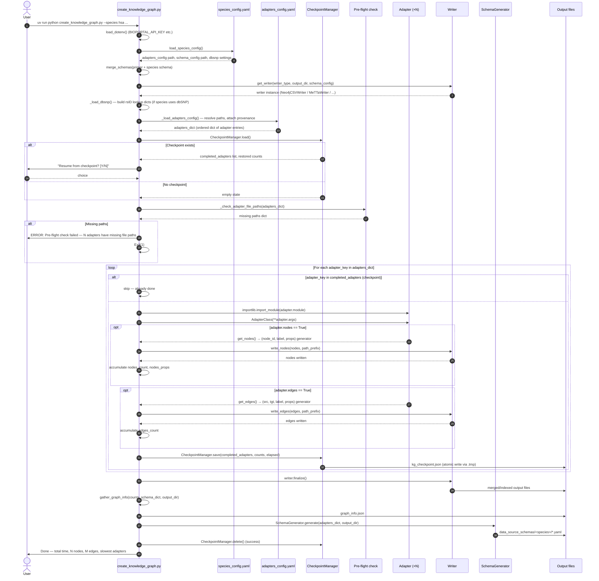
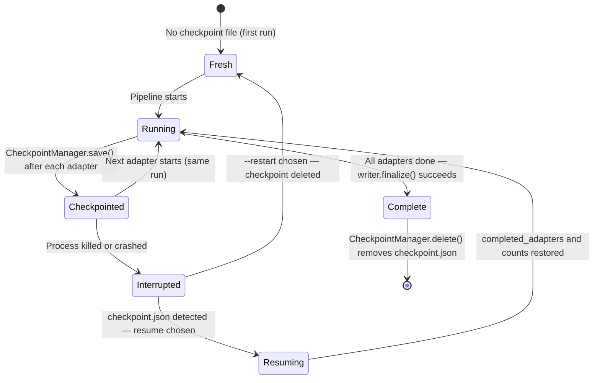
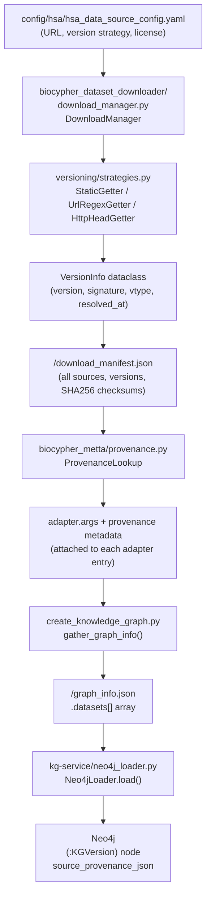
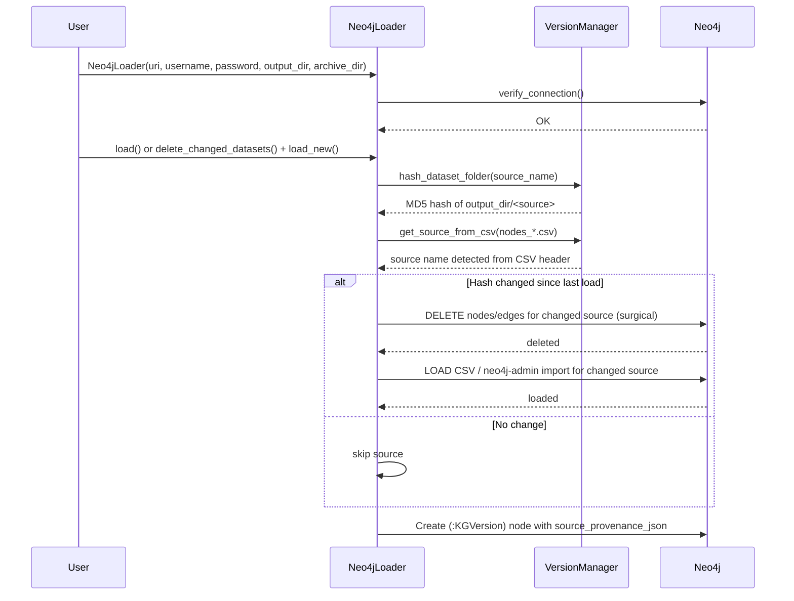

# Data Flow and Pipeline Diagrams

This document describes the execution sequence of the BioCypher-KG pipeline using Mermaid diagrams. For component descriptions and file locations, see [system-overview.md](system-overview.md).

---

## Pipeline execution sequence

The following diagram shows the top-level execution flow of `create_knowledge_graph.py::main()`.



---

## Checkpoint state machine

The `CheckpointManager` class in [`checkpoint_manager.py`](../../checkpoint_manager.py) persists state to `<output_dir>/kg_checkpoint.json` after each adapter completes. This enables interrupted runs to resume from the last successfully completed adapter.



### Checkpoint file schema

Written atomically (via `.tmp` → rename) to `<output_dir>/kg_checkpoint.json`:

```json
{
    "pipeline_id": "<output_dir>::<adapters_config>",
    "created_at": "2026-06-13T10:00:00",
    "updated_at": "2026-06-13T11:30:00",
    "completed_adapters": ["gencode_gene", "uniprotkb_sprot", ...],
    "failed_adapter": null,
    "nodes_count": {"gene": 62000, "protein": 20000, ...},
    "nodes_props": {"gene": ["gene_name", "gene_type"], ...},
    "edges_count": {"interacts_with|protein|protein": 4500000, ...},
    "datasets_dict": {...},
    "elapsed_seconds": 5400.0
}
```

`pipeline_id` is checked on resume — a mismatch (different output dir or different adapters config) silently discards the checkpoint and starts fresh.

---

## Versioning and download flow

This diagram shows how data source versions are tracked from configuration to the Neo4j provenance node.



For the full versioning specification, see [dataset-versioning.md](../knowledge-graph/dataset-versioning.md).

---

## Neo4j loading sequence

The `Neo4jLoader` in [`kg-service/neo4j_loader.py`](../../kg-service/neo4j_loader.py) supports incremental updates via surgical deletion of changed datasets.



---

## Component hierarchy

```mermaid
classDiagram
    class Adapter {
        +source: str
        +version: str
        +source_url: str
        +get_nodes() Iterator[tuple]
        +get_edges() Iterator[tuple]
    }

    class BaseWriter {
        +write_nodes(nodes, path_prefix)
        +write_edges(edges, path_prefix)
        +finalize()
    }

    class BaseMappingProcessor {
        +fetch_data() Any
        +process_data(raw) dict
        +load_or_update() dict
    }

    Adapter <|-- GencodeGeneAdapter
    Adapter <|-- UniProtAdapter
    Adapter <|-- StringPPIAdapter
    Adapter <|-- ReactomeAdapter
    Adapter <|-- GeneOntologyAdapter
    Adapter <|-- "... 75 more adapters"

    BaseWriter <|-- Neo4jCSVWriter
    BaseWriter <|-- MeTTaWriter
    BaseWriter <|-- PrologWriter
    BaseWriter <|-- ParquetWriter
    BaseWriter <|-- KGXWriter
    BaseWriter <|-- NetworkXWriter
    BaseWriter <|-- Neo4jWriter

    BaseMappingProcessor <|-- DBSNPProcessor
    BaseMappingProcessor <|-- EnsemblUniProtProcessor
    BaseMappingProcessor <|-- EntrezEnsemblProcessor
    BaseMappingProcessor <|-- GOSubontologyProcessor
    BaseMappingProcessor <|-- HGNCProcessor

    Adapter --> BaseMappingProcessor: uses (constructor arg)
    GencodeGeneAdapter --> "config/species_config.yaml": reads
    StringPPIAdapter --> EnsemblUniProtProcessor: uses
```

---

## Pre-flight path validation flow

Before any adapter runs, `_check_adapter_file_paths()` validates all declared file paths:

```mermaid
flowchart TD
    A[Load adapters_dict] --> B[For each adapter entry]
    B --> C{Is arg a path key?}
    C -- No --> B
    C -- Yes --> D{Path.exists?}
    D -- Yes --> B
    D -- No --> E[Add to missing dict]
    E --> B
    B --> F{All adapters checked}
    F --> G{missing is empty?}
    G -- Yes --> H[Pre-flight passed → continue]
    G -- No --> I[Print grouped error report\nERROR: N adapter(s) have missing file paths]
    I --> J[Exit 1]
```

To skip this check: `--skip-preflight` flag or `make run-sample SKIP_PREFLIGHT=yes`.

To validate paths without running adapters: `make check-paths ADAPTERS_CONFIG=...` or `--check-only` flag.
