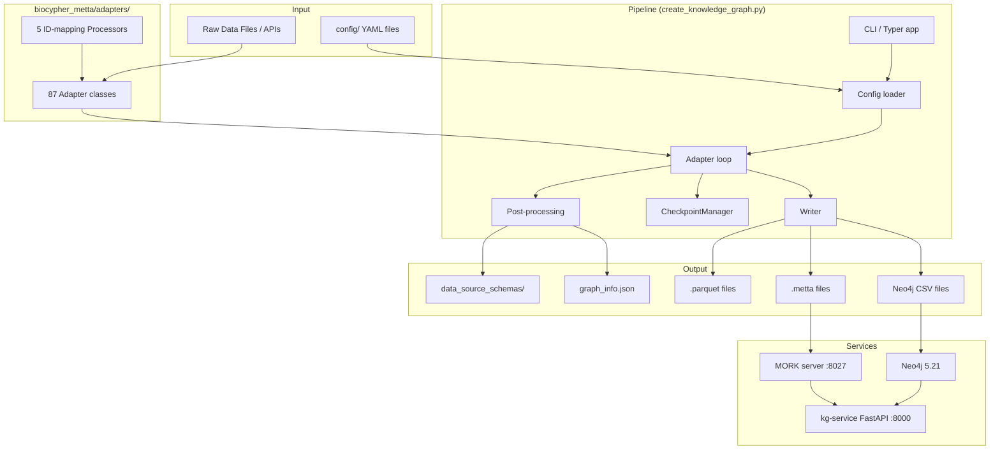

# System Overview

BioCypher-KG is a multi-species biological knowledge graph construction pipeline built on the [BioCypher framework](https://github.com/biocypher/biocypher). It reads raw biological data from 40+ data sources, normalises them through typed adapters, and writes a unified knowledge graph in one of seven output formats.

---

## What it does

Given a species (e.g., `hsa` for human), the pipeline:

1. Loads a YAML adapter registry that declares which data files to read and which adapter class to use for each
2. Iterates over every adapter, calling `get_nodes()` and `get_edges()` on each to yield typed biological entities and relationships
3. Passes every node and edge through a writer that serialises them to the chosen output format
4. Writes a `graph_info.json` summary and per-source `data_source_schemas/` YAML files

The result is a consistent, schema-validated knowledge graph that can be loaded into Neo4j, queried with MeTTa/OpenCog Hyperon, processed with Apache Parquet, or used directly as a NetworkX or KGX graph.

---

## Supported species

| Species | Code | Status |
|---|---|---|
| *Homo sapiens* (human) | `hsa` | Production-ready |
| *Drosophila melanogaster* (fruit fly) | `dmel` | Production-ready |
| *Mus musculus* (mouse) | `mmu` | In development — ontology adapters only |
| *Caenorhabditis elegans* | `cel` | In development — ontology adapters only |
| *Rattus norvegicus* (rat) | `rno` | In development — config declared, adapters missing |

Source: [`config/species_config.yaml`](https://github.com/rejuve-bio/biocypher-kg/blob/main/config/species_config.yaml). Species `mmu` and `cel` have adapter and schema configs with ontology-only adapters. Species `rno` is declared but `config/rno/rno_adapters_config.yaml` and `config/rno/rno_schema_config.yaml` are missing — attempting to run `rno` raises `FileNotFoundError`.

---

## Supported output formats

| Format | Writer class | Use case |
|---|---|---|
| MeTTa | `MeTTaWriter` | OpenCog Hyperon / MORK query engine |
| Neo4j CSV | `Neo4jCSVWriter` | Bulk import into Neo4j via `neo4j-admin` |
| Neo4j (direct) | `Neo4jWriter` | Live writes via the Neo4j Bolt driver — class only, not selectable via `--writer-type` |
| Prolog | `PrologWriter` | Logic reasoning systems |
| Apache Parquet | `ParquetWriter` | Analytics and data science workflows |
| KGX JSON | `KGXWriter` | Knowledge Graph Exchange standard |
| NetworkX | `NetworkXWriter` | In-memory graph analysis with Python |

Writer classes are in [`biocypher_metta/`](https://github.com/rejuve-bio/biocypher-kg/tree/main/biocypher_metta/) — see [writers.md](../knowledge-graph/writers.md) for details.

---

## High-level component map



---

## Pipeline execution sequence

The entry point is `create_knowledge_graph.py::main()` (a [Typer](https://typer.tiangolo.com/) CLI app registered at module level as `app = typer.Typer()`).

```
1. Load .env (python-dotenv, optional)
2. Parse CLI arguments
3. Load species config   →  config/species_config.yaml
4. Merge schemas         →  config/primer_schema_config.yaml + config/{species}/{species}_schema_config.yaml
5. Instantiate writer    →  get_writer(writer_type, output_dir, schema_config_path)
6. Load dbSNP maps       →  DBSNPProcessor (if species uses dbSNP)
7. Check/restore checkpoint  →  CheckpointManager.load()
8. Pre-flight path validation  →  _check_adapter_file_paths()
9. For each adapter in adapters_config.yaml:
       a. importlib.import_module(adapter.module)
       b. AdapterClass(**adapter.args)
       c. writer.write_nodes(adapter.get_nodes(), path_prefix)
       d. writer.write_edges(adapter.get_edges(), path_prefix)
       e. Accumulate nodes_count, nodes_props, edges_count
       f. CheckpointManager.save(completed_adapters, counts, elapsed)
10. writer.finalize()
11. gather_graph_info()  →  graph_info.json
12. SchemaGenerator.generate()  →  data_source_schemas/
13. Delete checkpoint file on success
```

See [`docs/architecture/data-flow.md`](data-flow.md) for sequence diagrams.

---

## Two run modes

### Species mode (recommended)

Uses `config/species_config.yaml` to resolve all paths automatically.

```bash
uv run python create_knowledge_graph.py \
    --species hsa \
    --dataset sample \
    --output-dir ./output \
    --writer-type metta
```

### Manual mode

Requires explicit `--adapters-config` and `--schema-config` arguments.

```bash
uv run python create_knowledge_graph.py \
    --adapters-config config/hsa/hsa_adapters_config.yaml \
    --schema-config config/hsa/hsa_schema_config.yaml \
    --output-dir ./output \
    --writer-type neo4j
```

The `Makefile` wraps both modes with interactive prompts — `make run` is the recommended entry point for most users.

---

## Key source files

| File | Purpose |
|---|---|
| [`create_knowledge_graph.py`](https://github.com/rejuve-bio/biocypher-kg/blob/main/create_knowledge_graph.py) | Pipeline orchestrator — CLI, config loading, adapter loop, writing, finalisation |
| [`checkpoint_manager.py`](https://github.com/rejuve-bio/biocypher-kg/blob/main/checkpoint_manager.py) | `CheckpointManager` — persists state to `<output_dir>/kg_checkpoint.json` for crash recovery |
| [`biocypher_metta/adapters/__init__.py`](https://github.com/rejuve-bio/biocypher-kg/blob/main/biocypher_metta/adapters/__init__.py) | `Adapter` ABC — all adapters implement `get_nodes()` and `get_edges()` |
| [`biocypher_metta/__init__.py`](https://github.com/rejuve-bio/biocypher-kg/blob/main/biocypher_metta/__init__.py) | `BaseWriter` ABC — all writers implement `write_nodes()`, `write_edges()`, `finalize()` |
| [`biocypher_metta/processors/base_mapping_processor.py`](https://github.com/rejuve-bio/biocypher-kg/blob/main/biocypher_metta/processors/base_mapping_processor.py) | `BaseMappingProcessor` ABC — ID mapping with cached pickle files |
| [`config/species_config.yaml`](https://github.com/rejuve-bio/biocypher-kg/blob/main/config/species_config.yaml) | Species registry — maps species code + dataset type to adapter/schema config paths |
| [`config/primer_schema_config.yaml`](https://github.com/rejuve-bio/biocypher-kg/blob/main/config/primer_schema_config.yaml) | Shared base schema — 36 node types and 108 edge types, Biolink-compatible |
| [`biocypher_dataset_downloader/download_manager.py`](https://github.com/rejuve-bio/biocypher-kg/blob/main/biocypher_dataset_downloader/download_manager.py) | `DownloadManager` — dataset acquisition, version resolution, manifest generation |
| [`kg-service/backend/api/main.py`](https://github.com/rejuve-bio/biocypher-kg/blob/main/kg-service/backend/api/main.py) | FastAPI service exposing graph metadata |
| [`Makefile`](https://github.com/rejuve-bio/biocypher-kg/blob/main/Makefile) | Primary user interface — wraps CLI with interactive prompts |

---

## Infrastructure components

### Neo4j

Production graph database. Deployed via Docker Compose at [`docker/docker-compose.neo4j.yml`](https://github.com/rejuve-bio/biocypher-kg/blob/main/docker/docker-compose.neo4j.yml). Configured via [`docker/neo4j.env.example`](https://github.com/rejuve-bio/biocypher-kg/blob/main/docker/neo4j.env.example) (copy to `docker/neo4j.env`). Default ports: HTTP `7674`, Bolt `7887`.

Loading is handled by [`kg-service/neo4j_loader.py`](https://github.com/rejuve-bio/biocypher-kg/blob/main/kg-service/neo4j_loader.py) (`Neo4jLoader` class), which supports incremental updates with surgical deletion of changed datasets.

### MORK server

Rust-based OpenCog Hyperon MeTTa query engine. Deployed via [`biocypher-mork/docker-compose.yml`](https://github.com/rejuve-bio/biocypher-kg/blob/main/biocypher-mork/docker-compose.yml). Exposes port **8027** by default.

> **Note:** The kg-service `Settings` model in [`kg-service/backend/core/config.py`](https://github.com/rejuve-bio/biocypher-kg/blob/main/kg-service/backend/core/config.py) defaults `MORK_URL` to `http://localhost:8432`, which does not match the MORK container's port 8027. You must explicitly set `MORK_URL=http://localhost:8027` when running both services together. See [deployment.md](../operations/deployment.md).

### kg-service

FastAPI application ([`kg-service/backend/api/main.py`](https://github.com/rejuve-bio/biocypher-kg/blob/main/kg-service/backend/api/main.py)) exposing REST endpoints for graph metadata, version history, and summary statistics. A background scheduler refreshes `graph_info.json` every 72 hours. See [endpoints.md](../api/endpoints.md).

---

## Further reading

| Topic | Document |
|---|---|
| Pipeline execution sequence with Mermaid diagrams | [data-flow.md](data-flow.md) |
| Component class hierarchy | [component-diagrams.md](component-diagrams.md) |
| Installation and first run | [local-development.md](../development/local-development.md) |
| All configuration files and env vars | [configuration.md](../operations/configuration.md) |
| Node and edge type reference | [data-model.md](../knowledge-graph/data-model.md) |
| Data source catalogue | [adapter-catalog.md](../knowledge-graph/adapter-catalog.md) |
| REST API reference | [endpoints.md](../api/endpoints.md) |
| Docker deployment | [deployment.md](../operations/deployment.md) |
