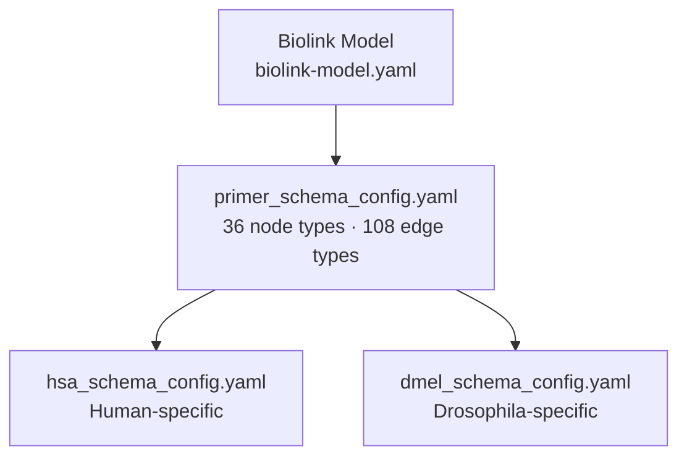

# Knowledge Graph Data Model

This document is the human-readable reference for all node types and edge types defined in the BioCypher-KG schema. The schema is defined in YAML files and processed by the BioCypher framework against the Biolink semantic model.

**Source files (ground truth):**
- [`config/primer_schema_config.yaml`](https://github.com/rejuve-bio/biocypher-kg/blob/main/config/primer_schema_config.yaml) — shared base schema (all species)
- [`config/hsa/hsa_schema_config.yaml`](https://github.com/rejuve-bio/biocypher-kg/blob/main/config/hsa/hsa_schema_config.yaml) — human-specific overrides/additions
- [`config/dmel/dmel_schema_config.yaml`](https://github.com/rejuve-bio/biocypher-kg/blob/main/config/dmel/dmel_schema_config.yaml) — Drosophila-specific additions

<!-- SCHEMA-COUNT: nodes=36 primer + additional hsa/dmel | edges=108+ primer -->
<!-- Run: grep -c "represented_as: node" config/primer_schema_config.yaml to verify -->

---

## Schema inheritance

The schema uses a three-level hierarchy:



`merge_schemas()` in `create_knowledge_graph.py` merges the primer schema with the species-specific schema before passing it to `BioCypher()`.

---

## Common property patterns

All nodes inherit from one of three archetypal base types:

| Base type | `input_label` | Key properties | What inherits from it |
|---|---|---|---|
| `position entity` | `position_entity` | `chr` (str), `start` (int), `end` (int), `taxon_id` (int) | gene, transcript, exon, promoter, regulatory_region, motif, tad, tfbs, genomic_variant, structural_variant, non_coding_rna |
| `coding element` | `coding_element` | `source` (str), `source_url` (str), `taxon_id` (int) | gene, transcript, exon, protein |
| `ontology term` | `ontology term` | `id` (str), `term_name` (str), `description` (str), `synonym` (str[]), `alternative_ids` (str[]), `source` (str), `source_url` (str) | disease, phenotype, anatomy, cell_type, cell_line, tissue, pathway, reaction, biological_process, molecular_function, cellular_component, small_molecule, developmental_stage, experimental_factor, molecular_interaction, sequence_type |

---

## Node types — Primer schema

### Genomic / structural nodes

| Node type | `input_label` | Biolink class | Key properties | CURIE prefix |
|---|---|---|---|---|
| `gene` | `gene` | `biolink:Gene` | `gene_name` (str), `gene_type` (str), `synonym` (str[]), inherits `position_entity` + `coding_element` | `ENSEMBL:ENSG...` |
| `transcript` | `transcript` | `biolink:Transcript` | `transcript_name` (str), `transcript_id` (str), `transcript_type` (str), inherits both base types | `ENSEMBL:ENST...` |
| `exon` | `exon` | `biolink:Exon` | `exon_number` (int), inherits both base types | `ENSEMBL:ENSE...` |
| `protein` | `protein` | `biolink:Protein` | `accessions` (str[]), `protein_name` (str), `is_canonical` (bool), `is_isoform` (bool), `canonical_accession` (str), `isoform_name` (str) | `UniProtKB:...` |
| `promoter` | `promoter` | `biolink:RegulatoryRegion` | inherits `non_coding_element` → `position_entity` | `EPD:...` |
| `regulatory region` | `regulatory_region` | `biolink:RegulatoryRegion` | `cell` (str), `biochemical_activity` (str), `biological_context` (str) | varies |
| `non coding element` | `non_coding_element` | `biolink:RNAProduct` | `biological_context` (str), `source`, `source_url` | varies |
| `non coding rna` | `non_coding_rna` | `biolink:RNAProduct` | `rna_type` (str), `taxon_id` (int) | `RNAcentral:...` |
| `transcription binding site` | `tfbs` | `biolink:RegulatoryRegion` | inherits `position_entity` | HOCOMOCO-based |
| `motif` | `motif` | `biolink:TranscriptionFactorBindingSite` | `tf_name` (str), `pwm_A` (float[]), `pwm_C` (float[]), `pwm_G` (float[]), `pwm_T` (float[]), `length` (int) | HOCOMOCO |

### Variant nodes

| Node type | `input_label` | Biolink class | Key properties |
|---|---|---|---|
| `genomic variant` | `genomic_variant` | `biolink:SequenceVariant` | inherits `position_entity`; `source`, `source_url` |
| `sequence variant` | `sequence_variant` | `biolink:SequenceVariant` | `rsid` (str), `ref` (str), `alt` (str), `raw_cadd_score` (float), `phred_score` (float) |
| `structural variant` | `structural_variant` | `biolink:SequenceVariant` | `variant_accession` (str), `variant_type` (str), `evidence` (str) |
| `tad` | `tad` | `biolink:GenomicEntity` | inherits `3d genome structure` → `position_entity` |
| `3d genome structure` | `3d_genome_structure` | `biolink:GenomicEntity` | inherits `position_entity` |
| `chromosome chain` | `chromosome_chain` | `biolink:GenomicEntity` | `chain_id` (str), `next_start` (int), `resolution` (str) |

### Epigenomic feature nodes

| Node type | `input_label` | Biolink class | Key properties |
|---|---|---|---|
| `epigenomic feature` | `epigenomic_feature` | `biolink:EpigenomicEntity` | `biological_context` (str), `source`, `source_url` |

### Ontology / functional nodes

| Node type | `input_label` | Biolink class | CURIE prefix |
|---|---|---|---|
| `ontology term` (base) | `ontology term` | `biolink:OntologyClass` | any OBO CURIE |
| `disease` | `disease` | `biolink:Disease` | `DOID:...`, `OMIM:...` |
| `phenotype` | `phenotype` | `biolink:OntologyClass` | `HP:...` |
| `anatomy` | `anatomy` | `biolink:AnatomicalEntity` | `UBERON:...` |
| `cell type` | `cell_type` | `biolink:Cell` | `CL:...` |
| `cell line` | `cell_line` | `biolink:CellLine` | `CLO:...` |
| `tissue` | `tissue` | `biolink:AnatomicalEntity` | `BTO:...` |
| `pathway` | `pathway` | `biolink:Pathway` | `REACTOME:R-HSA-...` |
| `reaction` | `reaction` | `biolink:MolecularActivity` | `REACTOME:R-HSA-...` |
| `biological process` | `biological_process` | `biolink:BiologicalProcess` | `GO:...` |
| `molecular function` | `molecular_function` | `biolink:MolecularActivity` | `GO:...` |
| `cellular component` | `cellular_component` | `biolink:CellularComponent` | `GO:...` |
| `small molecule` | `small_molecule` | `biolink:ChemicalEntity` | `CHEBI:...` |
| `developmental stage` | `developmental_stage` | `biolink:LifeStage` | `HsapDv:...`, `FBdv:...` |
| `experimental factor` | `experimental_factor` | `biolink:OntologyClass` | `EFO:...` |
| `molecular interaction` | `molecular_interaction` | `biolink:OntologyClass` | `MI:...` |
| `sequence type` | `sequence_type` | `biolink:OntologyClass` | `SO:...` |

---

## Node types — Species-specific additions

### Human (`hsa_schema_config.yaml`)

The human schema inherits all primer node types and may add taxon-specific constraints (`taxon_id: 9606`) or additional node types.

> **Note:** Human-specific node type additions are defined in [`config/hsa/hsa_schema_config.yaml`](https://github.com/rejuve-bio/biocypher-kg/blob/main/config/hsa/hsa_schema_config.yaml). This section is incomplete. Contributions welcome — see [CONTRIBUTING.md](https://github.com/rejuve-bio/biocypher-kg/blob/main/CONTRIBUTING.md).

### Drosophila (`dmel_schema_config.yaml`)

| Node type | `input_label` | Biolink class | Key properties |
|---|---|---|---|
| `allele` | `allele` | `biolink:Allele` | inherits `genomic variant`; Drosophila allele from FlyBase |
| `dmel disease model` | `dmel_disease_model` | `biolink:DiseaseModel` | FlyBase disease model associations |
| `gene group` | `gene_group` | varies | FlyBase gene groups (paralogs, functional sets) |
| `genotype` | `genotype` | `biolink:Genotype` | FlyBase genotype records |
| `phenotype set` | `phenotype_set` | `biolink:PhenotypicFeature` | FlyBase phenotype set |
| `rnaseq library` | `rnaseq_library` | `biolink:DataSet` | RNASeq experiment metadata from FlyBase |

All Drosophila-specific nodes carry `taxon_id: 7227`.

---

## Edge types — Primer schema

> **`output_label`** is the relationship type written to the output graph and used in Cypher queries.  
> **`input_label`** is the string the adapter code yields — used only internally by the pipeline.  
> When a schema entry has no explicit `output_label`, the graph uses `input_label` directly.

### Genomic structure edges

| `output_label` (graph) | `input_label` (adapter) | Source → Target | Biolink predicate |
|---|---|---|---|
| `part_of` | `part_of_gene` | exon → gene | `biolink:part_of` |
| `part_of` | `part_of_transcript` | exon → transcript | `biolink:has_part` |
| `transcribes_to` | `transcribes_to` | gene → transcript | `biolink:TranscriptToGeneRelationship` |
| `translates_to` | `translates_to` | transcript → protein | `biolink:translates_to` |
| `in_tad_region` | `in_tad_region` | gene → tad | `biolink:located_in` |

### Expression edges

| `output_label` (graph) | `input_label` (adapter) | Source → Target | Key properties |
|---|---|---|---|
| `expression` | `expression` | gene → any | base expression type |
| `expressed_in` | `gene_expressed_in_anatomy` | gene → anatomy | `score` (float), `p_value` (float) |
| `expressed_in` | `gene_expressed_in_developmental_stage` | gene → developmental stage | `score` (float), `p_value` (float) |
| `coexpressed_with` | `coexpressed_with` | gene → gene | `score` (float) |
| `coexpressed_with` | `protein_coexpressed_with` | protein → protein | `coexpression_score` (float) |

### GO annotation edges

| `output_label` (graph) | `input_label` (adapter) | Source → Target | Key properties |
|---|---|---|---|
| `involved_in` | `biological_process_gene` | gene → biological process | `evidence`, `db_reference`, `taxon_id` |
| `involved_in` | `biological_process_gene_product` | protein → biological process | same |
| `participates_in` | `biological_process_rna` | non_coding_rna → biological process | same |
| `enables` | `molecular_function_gene` | gene → molecular function | same |
| `enables` | `molecular_function_gene_product` | protein → molecular function | same |
| `enables` | `molecular_function_rna` | non_coding_rna → molecular function | same |
| `located_in` | `cellular_component_gene_located_in` | gene → cellular component | same |
| `part_of` | `cellular_component_gene_part_of` | gene → cellular component | same |
| `located_in` | `cellular_component_gene_product_located_in` | protein → cellular component | same |
| `part_of` | `cellular_component_gene_product_part_of` | protein → cellular component | same |
| `located_in` | `cellular_component_rna` | non_coding_rna → cellular component | same |

### Pathway / reaction edges

| `output_label` (graph) | `input_label` (adapter) | Source → Target |
|---|---|---|
| `participates_in` | `genes_pathways` | gene / transcript / protein → pathway |
| `participates_in` | `protein_pathways` | protein → pathway |
| `participates_in` | `transcript_pathways` | transcript → pathway |
| `participates_in` | `small_molecule_to_pathway` | small molecule → pathway |
| `involved_in` | `gene_or_gene_product_reaction` | gene → reaction |
| `involved_in` | `protein_reaction` | protein → reaction |
| `involved_in` | `transcript_reaction` | transcript → reaction |
| `participates_in` | `small_molecule_to_reaction` | small molecule → reaction |
| `part_of` | `reaction_to_pathway` | reaction → pathway |
| `regulates` | `protein_regulates_pathway` | protein → pathway (catalyst) |
| `regulates` | `protein_regulates_reaction` | protein → reaction (catalyst) |
| `enables` | `protein_enables_pathway` | protein → pathway (input role) |
| `enables` | `protein_enables_reaction` | protein → reaction (input role) |
| `produced_by` | `protein_produced_by_pathway` | protein → pathway (output role) |
| `produced_by` | `protein_produced_by_reaction` | protein → reaction (output role) |
| `positively_regulates` | `protein_positively_regulates_pathway` | protein → pathway |
| `positively_regulates` | `protein_positively_regulates_reaction` | protein → reaction |
| `negatively_regulates` | `protein_negatively_regulates_pathway` | protein → pathway |
| `negatively_regulates` | `protein_negatively_regulates_reaction` | protein → reaction |
| `child_pathway_of` | `child_pathway_of` | pathway → pathway |
| `parent_pathway_of` | `parent_pathway_of` | pathway → pathway |
| `equivalent_to` | `pathway_to_biological_process` | pathway → biological process |
| `pathway_to_cellular_component` | `pathway_to_cellular_component` | pathway → cellular component |
| `pathway_to_molecular_function` | `pathway_to_molecular_function` | pathway → molecular function |

### Regulatory edges

| `output_label` (graph) | `input_label` (adapter) | Source → Target | Key properties |
|---|---|---|---|
| `associated_with` | `enhancer_gene` | enhancer (regulatory_region) → gene | `score` (float), `biological_context` (str) |
| `associated_with` | `super_enhancer_gene` | super enhancer → gene | `score`, `biological_context` |
| `associated_with` | `promoter_gene` | promoter → gene | `score`, `biological_context` |
| `regulates` | `regulatory_region_gene` | regulatory_region → gene | `score`, `biological_context` |
| `regulates` | `tf_gene` | gene (TF) → gene | `evidence` (str[]), `detection_method` (str), `database` (str[]) |
| `binds_to` | `gene_tfbs` | gene → tfbs | `score` (float) |
| `interacts_with` | `interacts_with` | protein → protein | `score` (float), `interaction_type` (str), `reactome_pathway` (str) |

### Disease / phenotype / variant edges

| `output_label` (graph) | `input_label` (adapter) | Source → Target | Key properties |
|---|---|---|---|
| `associated_with` | `gene_disease` | gene → disease | `gene_symbol`, `association_type`, `source_ref` |
| `involved_in` | `gene_phenotype` | gene → phenotype | `gene_symbol`, `phenotype_name`, `frequency`, `disease_id` |
| `is_implicated_in` | `is_implicated_in` | gene → disease | `evidence_code`, `reference`, `data_source` |
| `is_marker_for` | `is_marker_for` | gene → disease | same fields |
| `is_model_of` | `is_model_of` | gene → disease | same fields |
| `implicated_via_orthology` | `implicated_via_orthology` | gene → disease | `with_ortholog`, `inferred_from_id/symbol` |
| `biomarker_via_orthology` | `biomarker_via_orthology` | gene → disease | same |
| `overlaps` | `gene_overlaps_structural_variant` | gene → structural variant | — |
| `overlaps` | `non_coding_rna_overlaps_structural_variant` | non_coding_rna → structural variant | — |
| `overlaps` | `promoter_overlaps_structural_variant` | promoter → structural variant | — |
| `overlaps` | `feature_overlaps_structural_variant` | biological entity → structural variant | — |
| `overlaps` | `structural_variant_overlaps_feature` | structural variant → biological entity | — |
| `overlaps` | `structural_variant_overlaps_gene` | structural variant → gene | — |
| `overlaps` | `structural_variant_overlaps_non_coding_rna` | structural variant → non_coding_rna | — |
| `overlaps` | `structural_variant_overlaps_promoter` | structural variant → promoter | — |

### Evolutionary edges

| `output_label` (graph) | `input_label` (adapter) | Source → Target | Key properties |
|---|---|---|---|
| `ortholog_of` | `orthologs_genes` | gene → gene | `DIOPT_score` (int), `source_organism`, `taxon_id`, `target_organism_taxon_id` |
| `paralogs_genes` | `paralogs_genes` | gene → gene | `source_symbol`, `target_symbol`, `DIOPT_score`, `taxon_id` |

### Ontology hierarchy edges

| `output_label` (graph) | `input_label` (adapter) | Source → Target |
|---|---|---|
| `subclass_of` | `subclass_of` | ontology term → ontology term |
| `is_a` | `biological_process_subclass_of` | biological process → biological process |
| `is_a` | `molecular_function_subclass_of` | molecular function → molecular function |
| `is_a` | `cellular_component_subclass_of` | cellular component → cellular component |
| `is_a` | `chebi_subclass_of` | small molecule → small molecule |
| `is_a` | `cl_subclass_of` | cell type → cell type |
| `is_a` | `clo_subclass_of` | cell line → cell line |
| `is_a` | `do_subclass_of` | disease → disease |
| `is_a` | `efo_subclass_of` | experimental factor → experimental factor |
| `is_a` | `hpo_subclass_of` | phenotype → phenotype |
| `is_a` | `mi_subclass_of` | molecular interaction → molecular interaction |
| `is_a` | `so_subclass_of` | sequence type → sequence type |
| `is_a` | `uberon_subclass_of` | anatomy → anatomy |
| `is_a` | `bto_subclass_of` | tissue → tissue |

### Anatomy / cell hierarchy edges

| `output_label` (graph) | `input_label` (adapter) | Source → Target |
|---|---|---|
| `part_of` | `cell_type_part_of_tissue` | cell type → tissue |
| `part_of` | `tissue_part_of_anatomy` | tissue → anatomy |
| `capable_of` | `cl_capable_of` | cell type → biological process |
| `part_of` | `cl_part_of` | cell type → anatomy |
| `is_a` | `cell_line_is_a_cell_type` | cell line → cell type |

### Cross-reference edges

| `output_label` (graph) | `input_label` (adapter) | Source → Target | Key properties |
|---|---|---|---|
| `has_xref` | `has_xref` | biological entity → biological entity | `xref_db` (str), `evidence` (str[]) |
| `has_xref` | `protein_has_xref_gene` | protein → gene | — |
| `has_xref` | `protein_has_xref_transcript` | protein → transcript | — |
| `has_xref` | `protein_has_xref_protein` | protein → protein | — |
| `has_xref` | `protein_has_xref_biological_process` | protein → biological process | — |
| `has_molecular_function` | `protein_has_xref_molecular_function` | protein → molecular function | — |
| `has_xref` | `protein_has_xref_cellular_component` | protein → cellular component | — |
| `has_xref` | `protein_has_xref_cofactor` | protein → small molecule | — |
| `has_xref` | `protein_has_xref_catalytic_activity` | protein → small molecule | — |
| `has_xref` | `protein_has_xref_binding_site_ligand` | protein → small molecule | — |
| `part_of` | `chemical_substance_part_of_chemical_substance` | small molecule → small molecule | `evidence` (str[]) |

### Generic structural edges

| `output_label` (graph) | `input_label` (adapter) | Source → Target |
|---|---|---|
| `annotation` | `annotation` | ontology term / gene → any |
| `has_part` | `has_part` | ontology term → ontology term |
| `part_of` | `part_of` | ontology term → ontology term |
| `regulatory_association` | `regulatory_association` | genomic entity → genomic entity |

---

## Schema YAML structure reference

Every node declaration in a schema YAML follows this pattern:

```yaml
gene:
  represented_as: node
  preferred_id: ensembl          # optional CURIE prefix
  input_label: gene              # what adapters yield as the label string
  is_a:                          # parent type(s) — inherits their properties
  - coding element
  - position entity
  mixins:
  - biolink:Gene
  biolink_category: biolink:Gene
  inherit_properties: true       # inherit properties from parent types
  properties:
    gene_name:
      type: str
      biolink: name
    synonym:
      type: str[]                # str[] = list of strings
      biolink: synonym
```

Every edge declaration:

```yaml
gene to pathway association:
  represented_as: edge
  input_label: genes_pathways    # what adapters yield as the edge label
  output_label: participates_in  # written to output files (optional)
  source: gene                   # or list: [gene, transcript, protein]
  target: pathway
  biolink_predicate: biolink:participates_in
  is_a: annotation               # parent edge type
  inherit_properties: true
  properties:
    source:
      type: str
      biolink: knowledge_source
```

---

## Biological coverage by domain

| Domain | Node types | Edge types | Primary data sources |
|---|---|---|---|
| Genomics | gene, transcript, exon, protein, non_coding_rna | `transcribes_to`, `translates_to`, `part_of` | GENCODE, UniProt, RNAcentral |
| Interactions | protein (PPI), gene (TF-gene) | `interacts_with`, `regulates`, `binds_to` | STRING, TFLink, ENCODE |
| Pathways | pathway, reaction, biological_process | `participates_in`, `regulates`, `enables`, `produced_by`, `positively/negatively_regulates` | Reactome |
| GO annotations | biological_process, molecular_function, cellular_component | `involved_in`, `enables`, `located_in`, `part_of`, `participates_in` | GO/GAF |
| Disease | disease, phenotype | `associated_with`, `involved_in`, `is_implicated_in` | HPO, OMIM, Alliance, GWAS |
| Variants | sequence_variant, structural_variant | `overlaps` | dbSNP, dbVAR, DGV, CADD |
| Regulatory | regulatory_region, promoter, enhancer, motif, tad, tfbs | `associated_with`, `regulates`, `binds_to` | CATLAS, EnhancerAtlas, Roadmap, TADMap |
| Ontologies | anatomy, cell_type, cell_line, tissue, small_molecule, developmental_stage | `is_a` (14 variants), `part_of`, `capable_of` | UBERON, CL, ChEBI, BTO, HsapDv |
| Expression | gene | `expressed_in`, `coexpressed_with` | Bgee, GTEx, CoXpressDB |
| Evolution | gene | `ortholog_of`, `paralogs_genes` | Alliance, FlyBase, STRING |

---

## Querying the schema in Neo4j

When loaded into Neo4j, node types become node labels and edge `output_label` values become relationship types. Example Cypher queries:

```cypher
// All genes
MATCH (g:gene) RETURN g LIMIT 10

// Genes expressed in a tissue
MATCH (g:gene)-[:expressed_in]->(a:anatomy)
WHERE a.term_name = 'liver'
RETURN g.gene_name, a.term_name LIMIT 20

// Protein interactions above threshold
MATCH (p1:protein)-[r:interacts_with]->(p2:protein)
WHERE r.score > 0.7
RETURN p1.protein_name, p2.protein_name, r.score LIMIT 10

// Gene-disease associations
MATCH (g:gene)-[:associated_with]->(d:disease)
RETURN g.gene_name, d.term_name LIMIT 20
```

> **Note:** These queries use label names as defined by `output_label` values in the schema; they may differ between writer formats (Neo4j CSV vs. direct writer) and schema versions. Contributions welcome — see [CONTRIBUTING.md](https://github.com/rejuve-bio/biocypher-kg/blob/main/CONTRIBUTING.md).
